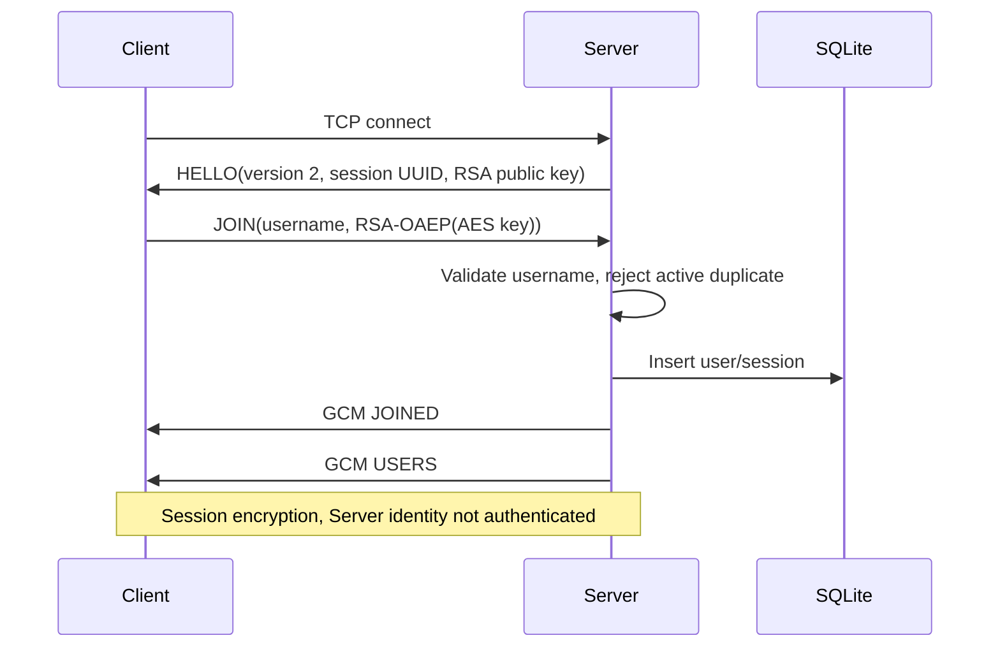
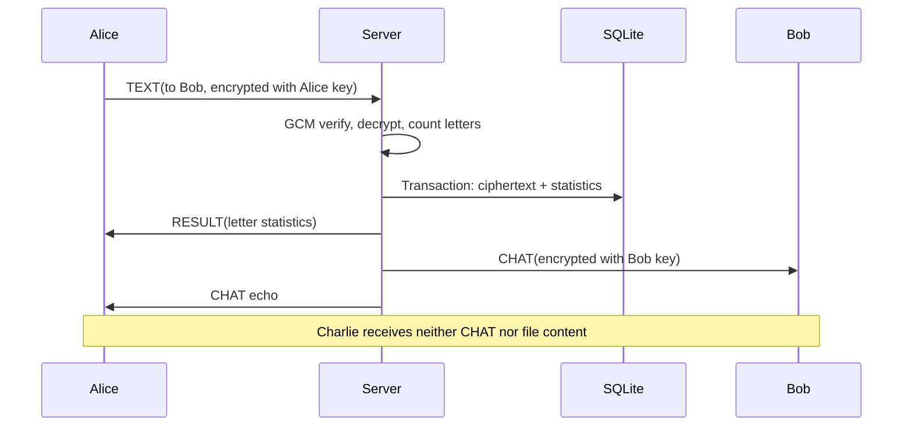
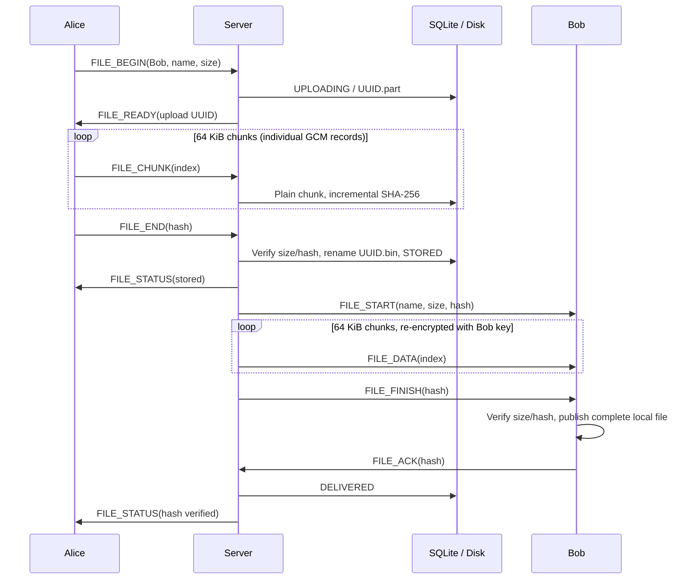
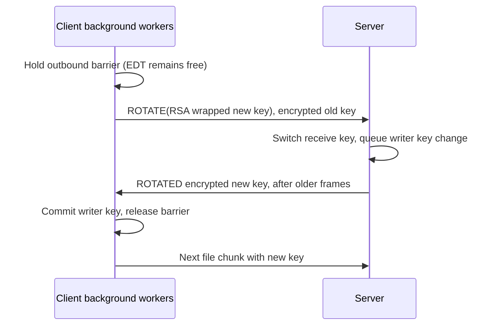

# Luồng chính v2

## Join / trao đổi khóa

```mermaid
sequenceDiagram
    participant C as Client
    participant S as Server
    participant DB as SQLite
    C->>S: TCP connect
    S->>C: HELLO(version 2, session UUID, RSA public key)
    C->>S: JOIN(username, RSA-OAEP(AES key))
    S->>S: Validate username, reject active duplicate
    S->>DB: Insert user/session
    S->>C: GCM JOINED
    S->>C: GCM USERS
    Note over C,S: Session encryption, Server identity not authenticated
```

## Chat riêng và thống kê

```mermaid
sequenceDiagram
    participant A as Alice
    participant S as Server
    participant DB as SQLite
    participant B as Bob
    A->>S: TEXT(to Bob, encrypted with Alice key)
    S->>S: GCM verify, decrypt, count letters
    S->>DB: Transaction: ciphertext + statistics
    S->>A: RESULT(letter statistics)
    S->>B: CHAT(encrypted with Bob key)
    S->>A: CHAT echo
    Note over A,B: Charlie receives neither CHAT nor file content
```

## File store-and-forward

```mermaid
sequenceDiagram
    participant A as Alice
    participant S as Server
    participant DB as SQLite / Disk
    participant B as Bob
    A->>S: FILE_BEGIN(Bob, name, size)
    S->>DB: UPLOADING / UUID.part
    S->>A: FILE_READY(upload UUID)
    loop 64 KiB chunks (individual GCM records)
        A->>S: FILE_CHUNK(index)
        S->>DB: Plain chunk, incremental SHA-256
    end
    A->>S: FILE_END(hash)
    S->>DB: Verify size/hash, rename UUID.bin, STORED
    S->>A: FILE_STATUS(stored)
    S->>B: FILE_START(name, size, hash)
    loop 64 KiB chunks, re-encrypted with Bob key
        S->>B: FILE_DATA(index)
    end
    S->>B: FILE_FINISH(hash)
    B->>B: Verify size/hash, publish complete local file
    B->>S: FILE_ACK(hash)
    S->>DB: DELIVERED
    S->>A: FILE_STATUS(hash verified)
```

## Đổi khóa đang truyền file

```mermaid
sequenceDiagram
    participant C as Client background workers
    participant S as Server
    C->>C: Hold outbound barrier (EDT remains free)
    C->>S: ROTATE(RSA wrapped new key), encrypted old key
    S->>S: Switch receive key, queue writer key change
    S->>C: ROTATED encrypted new key, after older frames
    C->>C: Commit writer key, release barrier
    C->>S: Next file chunk with new key
```
